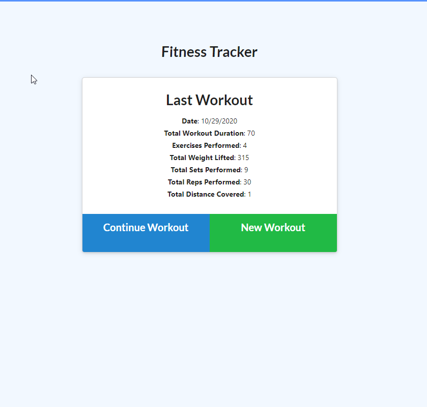
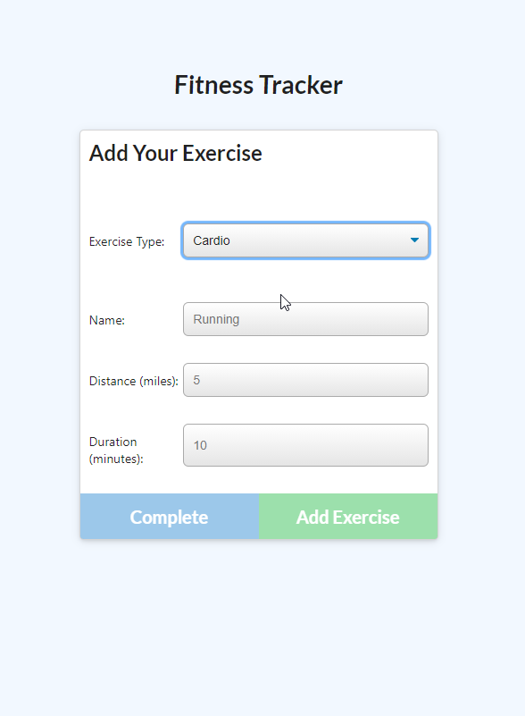
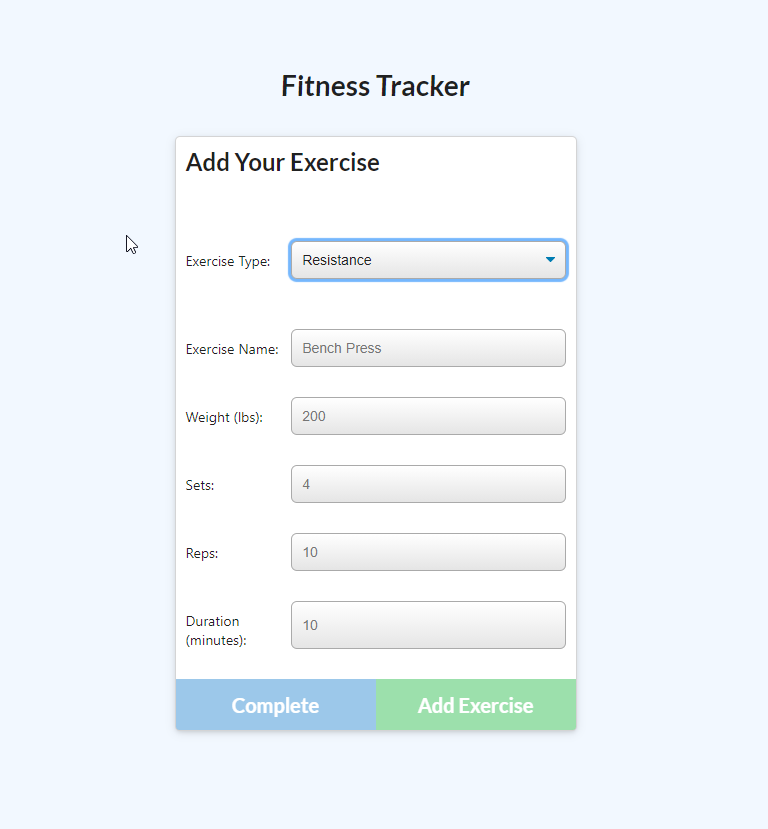
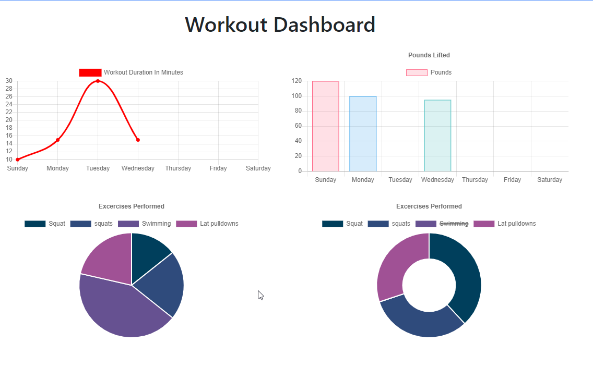

# Fitness Tracker

## Description 

This is a fitness traker app that I have made functional by creating and attaching a MongoDB database. 

The application allows the user to create workouts, add exercises to those workouts, and tracks each workout on a /stats page, displaying the information from the workouts in easy to read user interface. 

The app is run with Node.js and uses the npm package Mongoose to help Mongo interact with the application via Node.js. On my machine, the app uses a local database, but the deployed heroku version uses the MongoDB Atlas Cloud server.  

The front-end of the code was already created and provided to me. While I made a few modifications for testing purposes (mainly console.logs to see where things weren't working), the functionality of the code is unchanged. 

## Links 
Deployed Heroku application: https://pure-lowlands-73695.herokuapp.com/  
GitHub repository: https://github.com/jjbidwell/fitness-tracker  

## Screenshots  

  
  
  
  